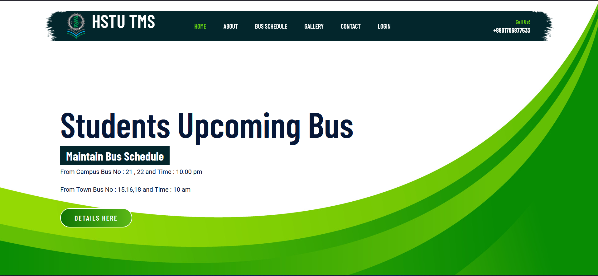

# HSTU Transport Management System

## 🚀 Project Overview
The **HSTU Transport Management System** is a web-based application designed to streamline and automate the transport management process at **Hajee Mohammad Danesh Science and Technology University (HSTU)**. It enables efficient management of transport schedules, bookings, vehicle tracking, and user requests.

## 🛠️ Technologies Used
- **PHP** - Backend development
- **MySQL** - Database management
- **Bootstrap 5** - Frontend UI design
- **HTML** - Structuring web pages
- **CSS** - Styling the application
- **JavaScript** - Interactive functionalities

## 📌 Features
- **User Authentication** (Admin, Staff, Students)
- **Vehicle Booking System**
- **Schedule Management**
- **Driver & Vehicle Information**
- **Real-time Notifications**
- **Report Generation**

## 🔧 Installation Steps
1. Clone the repository:
   ```sh
   git clone https://github.com/RakibulAzadd/HSTU-TMS
   ```
2. Navigate to the project directory:
   ```sh
   cd hstu-transport-management
   ```
3. Move the project to the XAMPP `htdocs` directory:
   ```sh
   mv hstu-transport-management /c/xampp/htdocs/
   ```
4. Start Apache and MySQL from XAMPP control panel.
5. Import the database:
   - Open **phpMyAdmin** in the browser.
   - Create a new database **hstu_tms**.
   - Import `hstu_tms.sql` from the `database` folder.
6. Configure database connection in `config.php`:
   ```php
   $conn = new mysqli("localhost", "root", "", "hstu_tms");
   ```
7. Run the project in your browser:
   ```
   http://localhost/hstu-transport-management/
   ```

## 📸 Screenshots


## 🎯 Future Enhancements
- Implement **Google Maps API** for live vehicle tracking.
- Add **Automated Notifications via Email/SMS**.
- Enhance **User Dashboard** for better experience.

## 🤝 Contributing
Contributions are welcome! Feel free to fork this repository and submit pull requests.

## 📜 License
This project is open-source and available under the **HSTU**.

## 📩 Contact
For any inquiries, reach out at **transport.hstu@example.com**.


